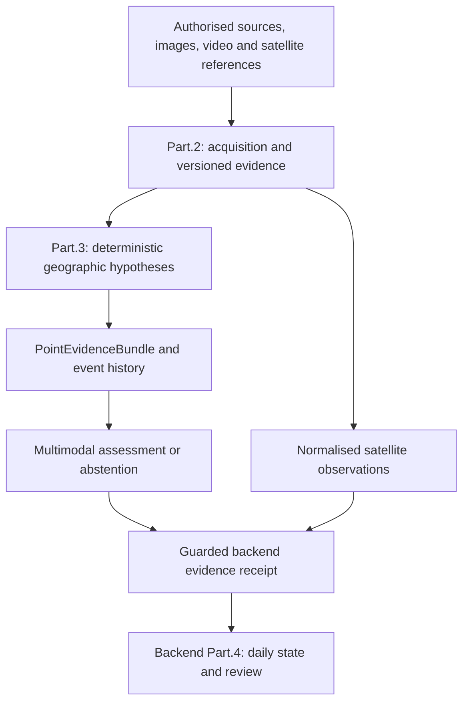

# FireViewer AI Worker

The FireViewer AI Worker acquires, transforms and assembles evidence for FireViewer incident analysis. It connects bounded source research, image/video processing, satellite observations, deterministic geographic hypotheses, optional accelerated providers, event memory and structured multimodal assessment.

> This component does not issue emergency alerts, publish incidents, define official coordinates or predict fire spread. Its outputs are versioned evidence and proposals that can be rejected, held for review or produce explicit abstention.

## Place in the system



The graph describes responsibilities, not an accepted live pipeline. The
worker does not create the administrative spatial seed, mutate a frozen
perimeter, or authorize public release.

The worker follows explicit provider boundaries. Search, multimodal extraction, visual detection, terrain, maps, satellite processing, cross-view evidence and final supervision can be replaced independently when they preserve the same contracts and failure semantics.

## Implemented areas

- strict `EventEvidence`, geographic-hypothesis, point-bundle and point-assessment contracts;
- bounded source acquisition, domain policies, query planning, evidence-gap waves, media discovery, deduplication and source tickets;
- bounded in-memory page/image extraction without turning acquisition into a shadow archive;
- durable video-keyframe extraction and image-space visual observations;
- upload-location, camera, map, terrain, visibility, uncertainty and history-aware geographic hypotheses;
- durable adapters for evidence, derived keyframes, geographic hypotheses, terrain references and point assessments;
- CLMS, Sentinel-2, Sentinel-3, bounded Sentinel-1 and NASA FIRMS evidence paths with source identity and coverage metadata;
- spatio-temporal event retrieval and compact evidence-bundle assembly;
- managed and simulated multimodal supervisors with strict structured output, contradiction handling and abstention;
- CPU and optional accelerated service/container boundaries;
- artifact-retention contracts for remotely retained models/datasets and bounded local scratch.

Presence in the repository does not mean that every provider is configured, funded, deployed or accepted on real data.

## Geographic safety boundary

Visual detectors supply image-space boxes, classes and scores only. They never produce authoritative coordinates.

Geographic candidates are built separately from documented upload/camera information, declared accuracy, orientation/FOV when available, terrain, maps, satellite evidence and earlier reviewed event states.

The final multimodal supervisor judges a supplied candidate. It may `accept`, `reject` or `abstain`; it may not silently mutate the source point. A proposed correction is a competing referenced object with its own evidence trail.

The worker does not author the final daily boundary. Reviewed spatial observations are consumed downstream by backend **Part.4 3.3**, where an allowlisted deterministic fusion profile reconstructs `affected`, `active` and uncertainty products. The current baseline profile remains uncalibrated and therefore cannot authorize unattended publication.

## Satellite evidence boundary

FireViewer keeps satellite product semantics explicit:

- CLMS and eligible optical-change observations can support affected-area evidence;
- Sentinel-3 and FIRMS remain thermal/activity likelihood footprints, not exact active fronts;
- Sentinel-1 is a bounded radar-change second opinion;
- multiple pixels or probability buckets from one product lineage remain one source lineage rather than independent votes.

Product availability does not imply live provider qualification.

## Bounded satellite corpus readers

The `satellite_corpus`, `cdse_corpus` and `sentinel1_corpus` modules expose
bounded CPU acquisition paths for historical reconstruction. They preserve
acquisition identity, source availability, coverage and retained derivative
receipts. A source published after the state cutoff is not historical evidence.

Sentinel-2 reflectance encoding is checked against the same original SAFE
product and native-grid samples, not inferred from a catalog offset flag.
Invalid spectra and SCL water cannot become positive burned-area support.
Archived-AOI repair verifies object identities and preserves grids instead of
searching for new scenes. These corrections create new corpus revisions and
never overwrite frozen predictions.

CLMS remains affected-area support, Sentinel-3/FIRMS remain thermal footprints,
and Sentinel-1 remains experimental modelled support. Missing detections do not
automatically create negative observations. Optional openEO processing is off
by default and requires explicit authorization and a verified bounded budget.
Code availability does not activate a provider or qualify a fusion profile.

## Data and retention

The acquisition layer retains evidence tickets, source references, hashes, derived claims, processing outcomes and failure information. It is not intended to retain complete scraped articles, copied public-media binaries or full transcripts by default.

No provider secrets, private incident payloads, generated inference dumps or large inactive checkpoints belong in Git.

Inactive artifacts are classified and, where appropriate, retained by immutable remote revision. Production code must not consume a common legacy archive directly.

## Model and artifact status

The public FireViewer model list is intentionally separate from the internal research/legacy inventory.

Deprecated, superseded, incomplete and low-quality historical checkpoints are consolidated in the private `fireviewer/fireviewer-legacy-models` archive when they are worth retaining for provenance or reproducibility. A legacy artifact must be re-evaluated and promoted into a dedicated repository before it can become a current runtime dependency.

Third-party weights remain pinned to their upstream provider/revision when redistribution is unnecessary or not authorised.

## Historical namespace

The Python package still uses the historical namespace `firewarning_worker` in multiple modules and contracts. It is retained for compatibility with existing imports, manifests and artifacts.

**The active project identity is FireViewer.** Renaming that namespace is a code migration, not a documentation cleanup, and must not be performed casually.

## Repository map

| Path | Purpose |
| --- | --- |
| `src/firewarning_worker/` | Core worker implementation and current compatibility namespace. |
| `contracts/` | Public/portable machine-readable evidence and retention contracts. |
| `eve-point-supervisor/` | Structured point-supervision harness and evaluation wiring. |
| `training/` | Training/research preparation and benchmark code; not a statement that every historical model is active. |
| `tools/` | Dataset, evaluation, conversion and operational preparation utilities. |
| `benchmarks/` | Bounded benchmark corpora/manifests and reproducibility material. |
| `deploy/` | Provider-specific deployment adapters; deployment files do not prove that a service is active. |

## Development

Python 3.11–3.13 is required.

```bash
python -m pip install -e ".[dev]"
ruff check src tests training
ruff format --check src tests training
mypy src
pytest -q
```

The Eve harness has its own Node workspace:

```bash
cd eve-point-supervisor
npm ci
npm run build
```

Unit tests, container builds and synthetic fixtures do not prove live cloud permissions, real-data quality or end-to-end publication readiness.

## Documentation

- [Source acquisition method](docs/SOURCE_ACQUISITION_METHOD.md)
- [`contracts/point-supervisor/v1`](contracts/point-supervisor/v1/README.md)
- [`contracts/geographic-hypotheses/v1`](contracts/geographic-hypotheses/v1/geographic-hypotheses.schema.json)
- [Canonical FireViewer documentation](https://github.com/fireviewer/Fireviewer_doc)
- [Current FireViewer status](https://github.com/fireviewer/Fireviewer_doc/blob/main/docs/public/STATUS.md)
- [Resource status](https://github.com/fireviewer/Fireviewer_doc/blob/main/docs/public/RESOURCES.md)

## Licensing and security

Code is licensed under AGPL-3.0-or-later. Original documentation is available under CC BY 4.0. Models, datasets, services and upstream assets retain their own terms.

See [SECURITY.md](SECURITY.md) for responsible disclosure.

## Contact

Research, infrastructure, provenance, rights or security: **unicornwhodev@gmail.com**.
